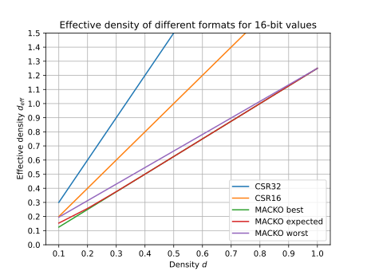
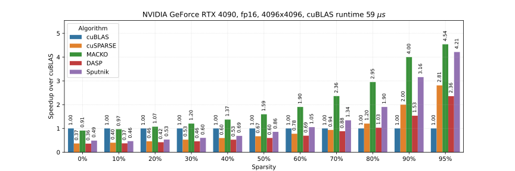
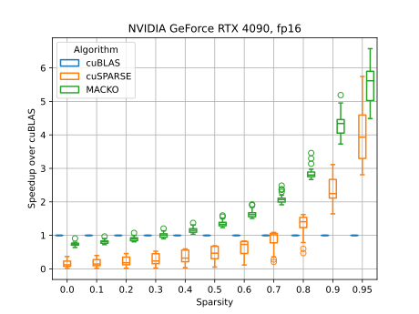
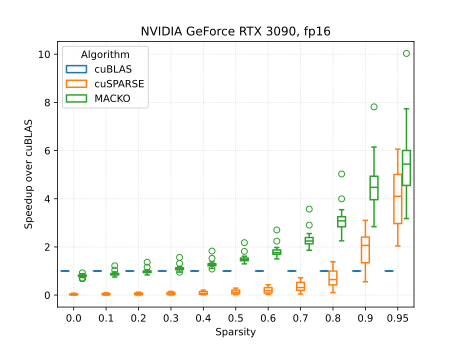
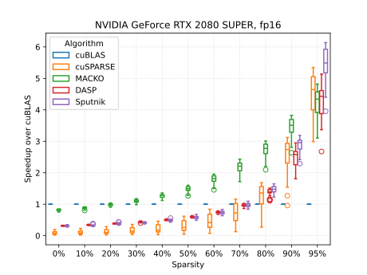

# Overview

MACKO-SpMV: **M**utually **A**ligned **C**ompressed coordinates **K**ernel **O**ptimised **Sp**arse **M**atrix **V**ector multiplication is a new format for representing sparse matrices and a cuda kernel for efficient matrix vector multiplication using this format.
It is targeted at sparsities between 20-90%, commonly seen in Neural Network pruning.

These sparsities were historically very hard to make use of in practice, because existing formats like CSR are not optimized for this range.
We hope this library will help to spark more interest in the field of neural network pruning and find uses outside it as well.
Debate whether quantization is better than pruning is beyond the scope of this work, but we hope we will help to bridge the gap.

For even more technical information see our paper (TODO coming soon). Here, we will go through the main ideas and results in an in-depth but more relaxed manner.

First we will go through some background, then see the format and algorithm design, analyze why it is good, and then see some results.
Headsup, this writing will still assume some very specific, and potentially obscure GPU knowledge. Feel free to raise an issue in our github.

## Background, CSR baseline

**C**ompressed **S**parse **R**ow is a common, well known format for representing sparse matrices, especially efficient for sparsities above 90%.

It is composed of 3 arrays:
- `values`: holds non zero values of the original matrix.
- `column_indices`: holds column index for each value, usually a 32-bit, possibly 16-bit integers.
- `row_pointers`: index to `values` and `column_indices` signifying the start of a given row.

The biggest problem of CSR in SpMV is the memory overhead it incures because of `column_indices`.  
`column_indices` are even more dominant if `values` are low precision (16-bit or less).
SpMV is a memory bound operation, and this memory overhead directly translates to slower runtime.

Why? Well SpMV needs to perform about 1 operation per 1 byte of accessed memory (ask chatgpt). 
Modern GPUs can perform a lot of operations in the same time in which they can read 1 byte (38-80 for consumer GPUs, all the way to 100 for server GPUs, just divide the FLOPS with memory bandwidth).

We need to design a format that does not have unnecesery memory overhead, but still respects constrains for efficient GPU execution.

TODO visual representation of CSR

## Background, SpMV

**Sp**arse **M**atrix **V**ector multiplication computes $Y=MV$, whre $M$ is a sparse matrix, and $V$ and $Y$ are dense column vector.
Common simplification of this problem is to impose some structure on $M$, like 2:4 sparsity, N:M sparsity, or block sparsity.
In a our case, there are no contraints on the structure of $M$. 

## MACKO storage format

We build upon the CSR format by introducing heavy compression of the `column_indices` and strategic padding of `values`.

We compress the `column_indices` of the CSR format using delta encoding, each delta is the difference of consecutive `column_indices`.
Then we strategically add 0 values to the `values` array in such a way that all deltas are capped at $2^4=16$.
This means, all deltas can be stored using $4$-bit integers (all deltas are at least 1 because the column indices are incremental).

We will end up with three arrays:
- `values`: same as before, holds non zero values of the original matrix, however now there can be some additional zeros. In general, values are $b_{val}$ bit entries.
- `deltas`: delta encoded `column_indices`, starts independently from 0 for each row. Now, these are 4-bit values, grouped in pairs to work with 8-bit memory words. In general, we can use $b_{\Delta}$-bits for each delta.
- `row_pointers`: index to `values` and `column_indices` signifying the start of a given row.

Assume one row with values $[1,2,3]$ in columns $[2,36,46]$. Because the difference between the first and second column index is higher that 16 we will need to add 2 zeros.
The resulting `values` array will be
$[1,0,0,2,3]$ and the `deltas` array will be $[2,16,16,2,10]$.

The questions are: How much padding do we need to add? What will be the $d_{eff}$ of this format?
Trust me, it will be ok. Lets first see the multiplication algorithm.

We will look at MACKO-16-4 ($b_{val}=16$, $b_{\Delta}=4$) optimized for fp16 values and broad range of sparsities. 
Many more combinations are possible.

TODO visual representation of MACKO

## MACKO SpMV algorithm

TODO visual representation of algorithm

MACKO-SpMV builds upon [Splitk GEMV](https://docs.nvidia.com/cutlass/media/docs/cpp/efficient_gemm.html). There are 3 key insights that are necessary to make this algorithm work.
Splitk GEMV assigns one warp to each row of matrix $M$ and each warp is responsible to compute the dot product of $V$ and one row. 
$$Y_r = M_r V$$

To make this algorithm efficient, we just need all memory loading to be coalesced, aligned and large enough to efficiently make use of the cache line.

**First insight**: after warp loads consecutive chunks of values from $M$ (`values`) and `deltas`, threads in the warp can efficiently reconstruct the column indices based on loaded deltas.
To reconstruct the indices, threads compute prefix sums of deltas using `__shfl_sync` cuda primitive.
We can compute the whole prefix sum across the whole warp in only 5 instructions.
Afterwards, the last thread holds the sum of all deltas in the current warp.
We broadcast this value across all threads and continue with the next chunk of `deltas` and `values`.

**Second insight** : `deltas` and `values` can be loaded in a way that is efficient and aligned.
If we load 128-bytes worth of deltas, and 512-bytes worth of values, each thread will load exactly 8 `deltas` and corresponding 8 `values` and no further communication or memory access is needed.

**Third insight**: even though rows can have an arbitrary number of elements, we can still perform proper vectorized memory access.
We just need to allow warp to potentially read part of the previous row.
This can be easily solved by masking the loaded values.

After each thread reconstructs the column indices, we read corresponding entries from $V$ and compute the dot product.
Finally, after warp processes the whole row, we aggregate the partial dot products across warp threads and store them in the result matrix.

## Padding analysis

### Notation

We have a matrix $M$ with $R$ rows and $C$ columns.
This matrix has density $d$, meaning it has $R⋅C⋅d$ non zero elements.
Density is $1-sparsity$.

Effective density $d_{eff}$ is a measure of quality of the storage format and answers the question: What will be the final disk size as a percentage of the dense representation?
Given that values of the original matrix require $b_{val}$ bits per value (fp16 requires 16 bits), we get:

$$d_{eff}=\frac{realstorage}{R⋅C⋅b_{val}}$$

For example, dense representation has $d_{eff}=1$ regardless of the matrix density.

CSR with 16-bit values and 32-bit column indices has $d_{eff}=3d$.
So if you prune your model to density $d=0.34$ (sparsity 66% ), the CSR representation will take 102% of the disk space (yes, you saved nothing :( ).

### Best case
In the best case, we will not need to add any padding.
In terms of storage, we just added $b_{\Delta}=4$ bits (to represent deltas) for every non zero value, and one index for each row.

$$d_{besteff} = \frac{R⋅C⋅d(b_{\Delta}+b_{val}) + 32R}{R⋅C⋅b_{val}}$$

After dropping the $\frac{32}{C⋅b_{val}}$ term we get

$$d_{besteff} = d\frac{(b_{\Delta}+b_{val})}{b_{val}} = 1.25~d$$

This is amazing! 
Our format becomes more effective then dense representation for density as high as 80% (respectively sparsity as low as 20%). 
Compared to CSR, where the break even point is sparsity 66.6%.

Also, for high density it is not that hard to achieve this perfect scenario.
Usual constraints from the N:M sparsity pattern, "have at most X out of Y", are pretty hard to optimize for, while our "have gap of at most 16" is easier and much less restrictive.
More importantly, this format works for any sparsity pattern, it may just take more space and run slower.

Small caveat, for small density this best case scenario implicitly limits the size of the matrix.
See what happens for $d=0.01$.

### Worst case

We can think about the situation as if every delta corresponding to a non zero value of $M$ "took care" of some zeroes.
If the delta between consecutive column indices is 16, it is awesome and our non zero just took care of 15 zeros.
On the other hand, if we have delta 17, we need to add a padding value and the actual delta corresponding to the non zero value will be just $1$ (didn't take care of anything).

In the worst case, all zeroes need to be covered by padding.
So we need to add $\frac{(1-d)⋅R⋅C}{2^{b_{\Delta}}}$ additional zeroes to our `values` array and corresponding entries to the `deltas` array.

$$d_{worsteff} = \frac{R.C(d+\frac{(1-d)}{2^{b_{\Delta}}})(b_{\Delta}+b_{val}) + 32R}{R.C.b_{val}}$$

We again drop the negligeable terms and get

$$d_{worsteff} = \left( d+\frac{(1-d)}{2^{b_{\Delta}}} \right) \frac{(b_{\Delta}+b_{val})}{b_{val}} = 1.25\left(d+\frac{1-d}{16}\right)$$

That right term is a mouthfull, but it is still pretty good.
For example now the break even point is at $d=0.75$ which is still very good.

### Average case

What about the average case? Let's say we have a matrix $M$ whose each element has probability $d$ of not being a zero.
This is not the same as having density $d$, but it is close enough.

It is like playing a game with an unfair coin that has probability $d$ of head and $1-d$ of tail.
For every $16$ consecutive tails you pay a penalty and reset your number of consecutive tails.

Let's define $z=(1-d)^{2^{b_{\Delta}}}$.
The expected effective density turns out to be

$$d_{expectedeff}= d  \left( 1 + \frac{z}{1-z} \right)\frac{(b_{\Delta}+b_{val})}{b_{val}}$$

The break even point is now still very close to $d=0.8$, the difference compared to the best case starts to be noticeable around $d=0.16$.

### Storage overview table

Here is a table with effective densities for various formats in % across various densities.

|   Density |   CSR32 |   CSR16 |   MACKO best |   MACKO expected |   MACKO worst |
|----------:|--------:|--------:|-------------:|-----------------:|--------------:|
|       1.0 |     3.0 |     2.0 |        1.250 |            1.250 |         1.250 |
|       0.9 |     2.7 |     1.8 |        1.125 |            1.125 |         1.133 |
|       0.8 |     2.4 |     1.6 |        1.000 |            1.000 |         1.016 |
|       0.7 |     2.1 |     1.4 |        0.875 |            0.875 |         0.898 |
|       0.6 |     1.8 |     1.2 |        0.750 |            0.750 |         0.781 |
|       0.5 |     1.5 |     1.0 |        0.625 |            0.625 |         0.664 |
|       0.4 |     1.2 |     0.8 |        0.500 |            0.500 |         0.547 |
|       0.3 |     0.9 |     0.6 |        0.375 |            0.376 |         0.430 |
|       0.2 |     0.6 |     0.4 |        0.250 |            0.257 |         0.312 |
|       0.1 |     0.3 |     0.2 |        0.125 |            0.153 |         0.195 |

Or in a graph:

Some interesting points:
- MACKO improves over dense representation slightly below $d=0.8$
- MACKO reaches $d_{eff}=0.5$ at $d=0.4$ for expected and best case and at $d=0.35$ for the worst case.
- MACKO improves over CSR with 16 bit column indices for all densities above $d=0.04$ in the best case and $d=0.1$ in the worst case.

## SpMV benchmarks

Benchmarking SpMV is notoriously tricky and high dimensional. Results can vary across GPUs, matrix sizes, data types and density levels.

Here we show results for NVIDIA GeForce RTX 4090 for small 4096x4096 matrices, and across all shapes in our dataset.

Interesting points
- MACKO improves over cuSPARSE across all sparsities between 0 and 90%. There are shapes for which cuSPARSE can be faster for sparsities above 95%.
- MACKO improves over cuBLAS for sparsity above 30% in general, and for some shapes even above 20% (this is likely caused by cuBLAS not being optimized for this specific shape and GPU pair).

## Benchmarking details

All benchmarks are run for fp16 ($b_{val}=16$, $b_{\Delta}=4$).

We benchmark on 3 different consumer GPUs:
- NVIDIA_GeForce_RTX_2080_SUPER (desktop machine)
- NVIDIA_GeForce_RTX_3090 (vast.ai)
- NVIDIA_GeForce_RTX_4090 (vast.ai)

We compare against
- dense representation with cuBLAS multiplication, fp32 accumulator (kernel_id=2)
- CSR32 with cuSPARSE multiplication, fp32 accumulator (kernel_id=3)
- MACKO (kernel_id=7)

We run this across a large range of matrix sizes, all with random initialization and number of non zeroes set precisely to match the desired density.
Matrix sizes are taken from various popular LLM models and architectures.

In each case we run 100 warmup iterations, 1000 timing iterations and we flush cache before every run.
All matrices are stored in the GPU memory, but not cached.

See benchmarking script for precise parameters of the baselines and other methodological details.
In GPU benchmarking, trust nothing, only code is the source of truth.

All data can be seen in the `./c_benchmarking/results_16bit/<GPU_NAME>/results.txt` and all graphs in the `media` directory.

Raw data for some of the baselines (DASP, Sputnik) are in separate repositories.

# End2End benchmarks

We evaluate MACKO on the Llama-2-7b model pruned with [Wanda](https://arxiv.org/abs/2306.11695) in unstructured mode.
We use the model to generate 100 tokens either using the MACKO representation, or using the dense representation on NVIDIA 4090 GPU.
Finally we compute the average tokens/second.
Note that MACKO is a lossless format and perfectly reproduces the result of dense representation (up to rounding errors).

| Density | Dense peak memory size [GB] | MACKO peak memory size [GB] | MACKO relative memory difference [%] | Dense relative memory difference [%] | Dense speed [tokens/sec] | MACKO speed [tokens/sec] | MACKO relative speedup [%] |
| ------- | --------------------------- | ---------------------------- | ------------------------------------- | ------------------------------------ | ------------------------ | ------------------------- | --------------------------- |
| 0.80    | 13.59                       | 13.77                        | 1.30                                  | \-1.28                               | 66.55                    | 66.36                     | \-0.29                      |
| 0.70    | 13.59                       | 12.08                        | \-11.14                               | 12.53                                | 66.49                    | 73.88                     | 11.11                       |
| 0.60    | 13.59                       | 10.53                        | \-22.50                               | 29.03                                | 66.48                    | 85.46                     | 28.55                       |
| 0.50    | 13.59                       | 8.87                         | \-34.74                               | 53.23                                | 66.53                    | 98.60                     | 48.20                       |
| 0.40    | 13.59                       | 7.14                         | \-47.43                               | 90.22                                | 66.51                    | 119.27                    | 79.33                       |
| 0.30    | 13.59                       | 5.61                         | \-58.71                               | 142.19                               | 66.50                    | 150.78                    | 126.74                      |
| 0.20    | 13.59                       | 4.06                         | \-70.10                               | 234.47                               | 66.54                    | 193.79                    | 191.24                      |
| 0.10    | 13.59                       | 2.67                         | \-80.37                               | 409.51                               | 66.48                    | 255.01                    | 283.59                      |

We see that MACKO practically matches the dense representation at very high density of 80%, and we see a meaningfull 10% memory reduction and speedup for density 70%

For density 50%, we see a significatn 1.5x reduction in memory and 1.5x increase in number of tokens.

Finally, these improvements hold all the way to density 10%, where we see 5x memory reduction and 4x speedup.

If you want to reproduce End2End inference results, follow [technical instructions](../TECHNICAL_README.md).

# Conclusion

We managed to break a mytical boundary of 50% unstructured sparsity and showed, that with proper format and kernel it leads to practical memory reduction and speedups.

We hope this work will spark more interest in unstructured pruning, and helps to make sparsity more viable alternative to quantization. 

# Afterword

The process of running LLM efficiently in torch with custom multiplication kernels is more involved than one would expect.
If you attempt to do the same, be ready for the following:
- Integrate your kernel into python
- Integrate your kernel into torch
- Make the integration compatible with torch.compile
- Rewrite `.generate` function from transformers library to work with `StaticCache` and not change the computational graph during sampling
- Rewrite `.generate` again and make it deterministic and seedable
- If your kernel works with tensors of unpredictable sizes, implement custom model weight loading and architecture overriding.
- (technically optional): Make sure your kernel supports batch inputs
- (technically optional): Set up the kernel as a python package
